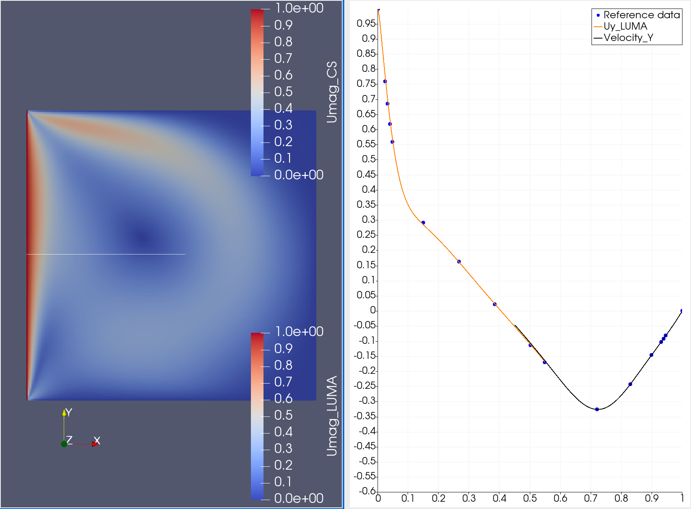

# Code_Saturne LUMA Coupling Tutorial

This tutorial will guide you through setting up a 2-dimensional lid-driven cavity simulation run using Code\_Saturne coupled to LUMA in a unit cube domain.  LUMA will evolve the portion $x \le 0.6$, and Code\_Saturne will evolve the portion $x \ge 0.4$.  The boundary $x=0$ is driven with a velocity $u_y = 1$.  Boundary data at the coupling boundaries is obtained from the other code using the PLE library.

## Get access to the coupling-enabled software

Versions of Code\_Saturne and LUMA which include support for coupling
between them, as well as the example lid-driven cavity case
definition, are available from the public repository
https://github.com/cfdemons/cs-luma-archer, as well as being installed
on ARCHER2.

To use the installed version,
```bash
module purge
source /work/ecseaa28/shared/software/cs-luma-ecse0128.0/setup.sh
```

Alternatively, to build the codes into a directory of your choice,
follow the [build instructions](README.md).

## Set up the case

The case definition, `$CS_LUMA_DIR/cases/ldc_left_right`, looks like this:

```
ldc_left_right
├── LEFT
│   └── definitions.h
├── RIGHT
│   ├── DATA
│   │   └── setup.xml
│   ├── SRC
│   │   └── cs_user_coupling.c
└── run.cfg
└── visualise.pvsm
```

The files are:

| File                 | Purpose                                                                        |
|----------------------|--------------------------------------------------------------------------------|
| `LEFT` and `RIGHT`   | The names of the two domains (evolved by LUMA and Code\_Saturne, respectively) |
| `definitions.h`      | LUMA case definition                                                           |
| `setup.xml`          | Code\_Saturne case definition                                                  |
| `cs_user_coupling.c` | Additional Code\_Saturne configuration related to coupling                     |
| `run.cfg`            | Includes specification of the mapping between domains and codes                |
| `visualise.pvsm`     | ParaView state file for 2D and profile visualisation                           |


On ARCHER2, the case must be set up in the "work" filesystem, as the home directory is not available on the compute nodes.

Change into the directory in which you want to set up the case, and copy the example case definition into this directory:
```
cp -a $CS_LUMA_DIR/cases/ldc_left_right .
```

At this point, you could customise the case by editing the configuration files, but for this tutorial, we will run the case as-is.

## Compile LUMA for this case

LUMA must be compiled for each case you want to run, as the case
parameters are configured through its definitions.h header file.

To compile a LUMA executable `LEFT/LUMA` using `LEFT/definitions.h`,

```
cd ldc_left_right
build-luma LEFT/definitions.h LEFT/LUMA CS_INSTALL=$CODE_SATURNE_DIR
```

## Submit the case

Write a batch script to run the case:

```
#!/bin/bash

#SBATCH --job-name       ldc_left_right
#SBATCH --output         log.txt
#SBATCH --ntasks         256
#SBATCH --nodes          2
#SBATCH --cpus-per-task  1
#SBATCH --account        ACCOUNT       # Change to your own account
#SBATCH --partition      standard
#SBATCH --time           3:00:00
#SBATCH --qos            lowpriority

set -eu

module purge
source /work/ecseaa28/shared/software/cs-luma-ecse0128.0/setup.sh

code_saturne run
```

and save it in the case directory as `submit.sh`.  Ensure that you enter your own ARCHER2 account as ACCOUNT.  The simulation will run with 128 LUMA processes on one node, and 128 Code\_Saturne processes on another node.

Submit the batch job:

```
sbatch submit.sh
```

When the job runs, log.txt will contain some logging information, but the detailed logs from the two codes will be in

```
RESU_COUPLING/*/LEFT/output_*/log_rank0.log
```

and

```
RESU_COUPLING/*/RIGHT/run_solver.log
```

The \* wildcards above are needed because those components of the paths are timestamps generated by Code\_Saturne and LUMA to ensure that the output from repeated runs goes to different directories.  The simulation should take about an hour to complete.

An example of the simulation output is available as a [Zenodo dataset](https://zenodo.org/record/7232085#.Y1G9Py0w3dc).

## Visualise with ParaView

The output of the coupled simulation can be visualised in [ParaView](https://www.paraview.org).  You can either run ParaView in client-server mode, with pvserver running on ARCHER2, and a local ParaView client running on your own computer, or you can copy the case output data to your own computer and visualise it directly with ParaView running there.  Documentation for using ParaView in client-server mode is available [here](https://docs.archer2.ac.uk/data-tools/paraview/).

### Postprocess the LUMA output from HDF5 to VTK format

The 3D LUMA field data will be in

```
RESU_COUPLING/*/LEFT/output_*/hdf_R0N0.h5
```

In order to visualise this in ParaView, it needs to be converted to VTK format:

```
cd RESU_COUPLING/*/LEFT/output_*
h5mgm
cd ../../../..
```

The VTK files will be generated in `RESU_COUPLING/*/LEFT/output_*/postprocessedoutput`.

### Copy data to your local machine

(This step is not necessary if you use ParaView in client-server mode.)

You can copy the data to your local machine with
```
rsync -avz USERNAME@login.archer2.ac.uk:/path/to/ldc_left_right .
```
making sure to replace /path/to with the path to the ldc\_left\_right directory on ARCHER2.

Download the Ghia et al. reference data from file [lid\_driven\_cavity\_literature1.txt](https://www.comsol.com/model/download/507511/lid_driven_cavity_literature1.txt) to a convenient location, e.g. next to ldc\_left\_right.

### Open the ParaView state file

We have provided a ParaView state file for ParaView 5.10.1 in the case directory.  It probably will not work with older versions of ParaView.

- Launch ParaView

- Go to `File -> Load State...`, navigate to `ldc_left_right/visualise.pvsm` and open it.

- In the Load State Options window, select Choose File Names

- For Code\_Saturne case file, navigate to `ldc_left_right/RESU_COUPLING/*/RIGHT/postprocessing/RESULTS_FLUID_DOMAIN.case` and click OK.

- For LUMA file name, navigate to `ldc_left_right/RESU_COUPLING/*/LEFT/output_*/postprocessedoutput/luma_000.*.vtu` and click OK.

- For Reference data file name, navigate to where you have saved `lid_driven_cavity_literature1.txt` and click OK.

If all goes well, ParaView will show a 2D plot of the velocity magnitude and a line plot of the velocity profile and a comparison with the reference data of Ghia et al. 

The following figure shows the result of the visualisation at time output index 37 (corresponding to 37 s in physical time).



If for some reason loading the state file does not work, you can follow the remaining steps in this tutorial to recreate the visualisation.  Make sure to first quit and reload ParaView.


### Visualise fluid velocity flow

A visualisation of the fluid velocity magnitude from both codes can be created using the following steps.

- Launch ParaView

- Next, open the LUMA fluid timeseries from `ldc_left_right/RESU_COUPLING/*/LEFT/output_*/postprocessedoutput/luma_000.*.vtu`.

- Next, open the Code\_Saturne fluid data from `ldc_left_right/RESU_COUPLING/*/RIGHT/postprocessing/RESULTS_FLUID_DOMAIN.case`.

- Select luma_000.* in the pipeline browser and click Apply, then rename it as "LUMA".

- Create a Slice filter of the LUMA dataset and click "Z Normal", then Apply.

- Create a Calculator filter for the Slice1 dataset with result array name Umag\_LUMA and formula
    ```
    sqrt(Ux^2 + Uy^2 + Uz^2) * 0.005/0.00125
    ```
  Click Apply.  The 0.005 and 0.00125 are the cell size and timestep in the LUMA simulation, respectively.  This is a conversion from LBM lattice units to physical units.

- Set Colouring to "Umag_LUMA". Rename the Calculator filter as "Umag\_LUMA".

- Select a Custom range for the colour map on the toolbar at the top from 0 to 1.

- Select `RESULTS_FLUID_DOMAIN.case` and rename it as Code\_Saturne.

- Select the Code\_Saturne dataset and create a slice filter, again clicking Z Normal and Apply.

- Create a calculator filter for the Slice2 dataset with result array name Umag_CS and formula
    ```
    mag(Velocity)
    ```
  and click Apply.  Rename the Calculator1 filter as "Umag\_CS".

- Select the custom colour range 0 to 1.

- Reset the view direction to "-Z" using the toolbar if necessary.

You should now be able to animate the visualisation using the animation controls in the toolbar.  The velocity profile should start on the left in the LUMA half of the domain, and propagate smoothly to the right into the Code\_Saturne part.

### Plot velocity profile

We will now plot a profile of $U_y$ at $y = 0.5$ as a function of $x$.

- Select Slice1 under LUMA and create a Calculator filter with result array name Uy_LUMA and formula
  ```
  Uy * 0.005/0.00125
  ```
  and click Apply.
  
- Select the calculator filter and create a Cell Data to Point Data filter, then click Apply.

- Create a Plot over line filter.  Click X Axis, then Apply.  Under Series Parameters, ensure that only Uy\_LUMA is selected.  Select X Array Name as Points_X.

- Select Slice2 under Code\_Saturne and create a Cell Data to Point Data filter, then click Apply.

- Create a Plot over line filter.  Click X Axis, then Apply.  Under Series Parameters, ensure that only Velocity\_Y is selected.  Select X Array Name as Points_X.

- The Line Chart View should now show $U_y$ as a function of $x$ for the data from the two codes at the current time. You can use the animation controls to view the velocity at different times.

### Compare velocity profile with reference data

- In ParaView, open lid\_driven\_cavity\_literature1.txt and click Apply.  Tick "Add Tab field delimiter" and click Apply.  Rename the dataset as "Reference data".

- Create a Calculator filter with Result Array Name "oneminusy" and formula
  ```
  1-"%y"
  ```
  Ensure that "Coordinate results" is unset.  Click Apply.  This coordinate mapping is required because of a difference in convention between the simulation and the reference data. Rename the Calculator filter as OneMinusY.
  
- Select the Line Chart View and ensure that OneMinusY is visible (click the eye icon next to OneMinusY in the Pipeline Browser).  Ensure that in the OneMinusY properties, only the 400 variable is selected (this is the data for Re = 400).  Set the Legend Name for 400 to "Reference data".  Deselect Use Index for X axis and choose the X array name as "oneminusy".  Set the line style to None and the marker style to Circle and marker size to 10.0. Change the color of the 400 line to blue.

- If any Spreadsheet views have been created from the tabular data, you can close them.

You should now have results similar to those shown in the screenshot above.
